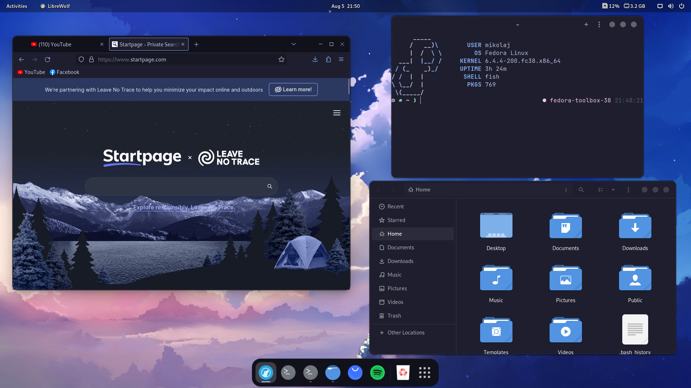

# dotfiles

mkalitka's dotfiles

## Requirements

- Any Github SSH key
- Gnome shell
- fish
- gcc
- neovim
- git
- exa
- afetch
- wget
- unzip
- flatpak
- io.gitlab.librewolf-community (flatpak)
- com.mattjakeman.ExtensionManager (flatpak)
- com.raggesilver.BlackBox (flatpak)

## Gnome shell extensions

- Dash to Dock
- User Themes
- Vitals
- Removable Drive Menu
- Caffeine
- Transparent Top Bar
- Clipboard Indicator

## Extensions for LibreWolf

- [uBlock Origin (installed by default)](https://addons.mozilla.org/en-US/firefox/addon/ublock-origin/)
- [Bitwarden](https://addons.mozilla.org/en-US/firefox/addon/bitwarden-password-manager/)
- [CanvasBlocker](https://addons.mozilla.org/en-US/firefox/addon/canvasblocker/)
- [Skip Redirect](https://addons.mozilla.org/en-US/firefox/addon/skip-redirect/)
- [ClearURLs](https://addons.mozilla.org/en-US/firefox/addon/skip-redirect/)
- [Stylus](https://addons.mozilla.org/en-US/firefox/addon/skip-redirect/)
- [Catppuccin Mocha - Blue (theme)](https://addons.mozilla.org/en-US/firefox/addon/skip-redirect/)

## Themes for Stylus
- [StartPage](https://github.com/catppuccin/userstyles/raw/main/styles/startpage/catppuccin.user.css)
- [YouTube](https://github.com/catppuccin/userstyles/raw/main/styles/youtube/catppuccin.user.css)
- [GitHub](https://github.com/catppuccin/userstyles/raw/main/styles/github/catppuccin.user.css)
- [ChatGPT](https://github.com/catppuccin/userstyles/raw/main/styles/chatgpt/catppuccin.user.css)
- [Proton](https://github.com/catppuccin/userstyles/raw/main/styles/proton/catppuccin.user.css)
- [Reddit](https://github.com/catppuccin/userstyles/raw/main/styles/reddit/catppuccin.user.css)

